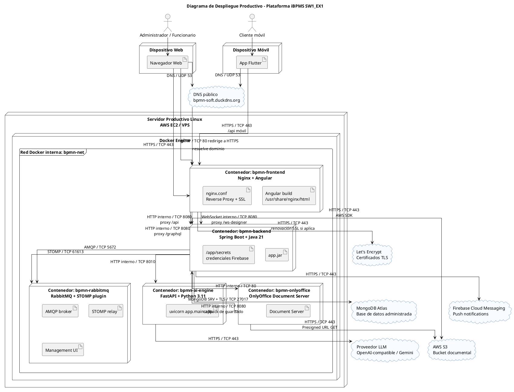

# Diagrama de Despliegue Productivo - Plataforma iBPMS SW1_EX1

## Objetivo

Este documento describe el despliegue productivo de la plataforma iBPMS `SW1_EX1`, indicando nodos físicos, contenedores, servicios externos, puertos y protocolos de comunicación.

El escenario productivo considerado es:

- Servidor Linux en AWS EC2 o VPS equivalente.
- Servicios ejecutados con Docker Compose.
- Nginx como punto de entrada público.
- HTTPS habilitado con certificados SSL/TLS.
- Backend, motor IA, OnlyOffice y RabbitMQ comunicándose por red interna Docker.
- MongoDB Atlas, AWS S3, Firebase y proveedor LLM como servicios externos.

---

# 1. Diagrama de Despliegue Productivo



---

# 2. Nodos Productivos

## 2.1 Clientes

### Dispositivo Web

Utilizado por:

- Administrador de software.
- Administrador de empresa.
- Funcionario.

Protocolo principal:

- `HTTPS / TCP 443`

El navegador accede al dominio público del sistema y consume la aplicación Angular servida por Nginx.

### Dispositivo Móvil

Utilizado por:

- Cliente de la aplicación móvil.

Protocolo principal:

- `HTTPS / TCP 443`

La aplicación Flutter consume las APIs del backend a través del dominio público protegido por Nginx.

---

# 3. Servidor Productivo

## 3.1 Servidor Linux / AWS EC2

Nodo físico o virtual donde se ejecuta Docker Engine.

Responsabilidades:

- Alojar los contenedores productivos.
- Exponer solamente los puertos públicos necesarios.
- Mantener la comunicación interna en la red Docker `bpmn-net`.
- Conectarse hacia servicios externos por protocolos seguros.

Puertos públicos recomendados:

| Puerto | Protocolo | Uso | Exposición |
|---:|---|---|---|
| 80 | HTTP/TCP | Redirección a HTTPS y validación de certificados. | Público |
| 443 | HTTPS/TCP | Entrada principal del sistema. | Público |

Puertos que deberían permanecer internos o restringidos:

| Puerto | Protocolo | Servicio | Recomendación |
|---:|---|---|---|
| 8080 | HTTP/TCP | Backend Spring Boot | No exponer públicamente. |
| 8010 | HTTP/TCP | FastAPI IA | No exponer públicamente. |
| 8082 | HTTP/TCP | OnlyOffice | Exponer solo si el navegador necesita cargarlo directamente; preferible pasarlo por Nginx/HTTPS. |
| 5672 | AMQP/TCP | RabbitMQ | Restringir a red interna. |
| 61613 | STOMP/TCP | RabbitMQ STOMP relay | Restringir a red interna. |
| 15672 | HTTP/TCP | RabbitMQ Management | Restringir por firewall/VPN. |

---

# 4. Contenedores Productivos

## 4.1 `bpmn-frontend`

Tecnologías:

- Nginx.
- Angular compilado.

Responsabilidades:

- Servir la aplicación web Angular.
- Terminar TLS/SSL en producción.
- Redirigir `HTTP / TCP 80` hacia `HTTPS / TCP 443`.
- Actuar como reverse proxy hacia Spring Boot.
- Mantener compatibilidad con WebSocket para el diseñador BPMN.

Rutas proxy:

| Ruta pública | Destino interno | Protocolo |
|---|---|---|
| `/` | Angular estático en Nginx | HTTPS público |
| `/api/` | `bpmn-backend:8080/api/` | HTTP interno |
| `/graphql` | `bpmn-backend:8080/graphql` | HTTP interno |
| `/ws-designer` | `bpmn-backend:8080/ws-designer` | WebSocket interno |

## 4.2 `bpmn-backend`

Tecnologías:

- Spring Boot.
- Java 21.

Puerto interno:

- `8080 / HTTP`

Responsabilidades:

- API de negocio.
- Seguridad y autorización.
- Ejecución de procesos.
- Gestión documental.
- Integración con S3.
- Integración con OnlyOffice.
- Integración con FastAPI.
- Generación de reportes.
- Notificaciones push.

Protocolos usados:

| Destino | Protocolo | Uso |
|---|---|---|
| MongoDB Atlas | MongoDB SRV + TLS / TCP 27017 | Persistencia. |
| AWS S3 | HTTPS / TCP 443 | Carga, descarga, reemplazo y URLs prefirmadas. |
| FastAPI | HTTP interno / TCP 8010 | IA, predicción y reportes. |
| OnlyOffice | HTTP interno / TCP 80 | Configuración/callbacks. |
| RabbitMQ | AMQP/STOMP sobre TCP | Eventos colaborativos. |
| Firebase | HTTPS / TCP 443 | Notificaciones push. |

## 4.3 `bpmn-ai-engine`

Tecnologías:

- Python 3.11.
- FastAPI.
- Uvicorn.

Puerto interno:

- `8010 / HTTP`

Responsabilidades:

- Copilot BPMN.
- Recomendación inteligente de trámites.
- Extracción de información.
- Análisis predictivo.
- Planificación de reportes dinámicos.

Protocolos usados:

| Destino | Protocolo | Uso |
|---|---|---|
| Backend Spring Boot | HTTP interno / TCP 8010 | Recibe solicitudes filtradas. |
| Proveedor LLM | HTTPS / TCP 443 | Procesamiento NLP. |

## 4.4 `bpmn-onlyoffice`

Tecnología:

- OnlyOffice Document Server.

Puerto interno:

- `80 / HTTP`

Responsabilidades:

- Renderizar el editor colaborativo.
- Descargar documentos originales mediante URL prefirmada.
- Enviar callback de guardado al backend.

Protocolos usados:

| Destino | Protocolo | Uso |
|---|---|---|
| Navegador web | HTTPS / TCP 443 si se publica por Nginx | Carga del editor. |
| AWS S3 | HTTPS / TCP 443 | Descarga del documento por URL prefirmada. |
| Backend Spring Boot | HTTP interno / TCP 8080 | Callback de guardado. |

Recomendación productiva:

OnlyOffice debería publicarse mediante Nginx bajo HTTPS, por ejemplo:

```text
https://bpmn-soft.duckdns.org/onlyoffice/
```

De esa forma se evita contenido mixto cuando la aplicación Angular está en HTTPS.

## 4.5 `bpmn-rabbitmq`

Tecnología:

- RabbitMQ 3.
- Plugin `rabbitmq_stomp`.

Puertos internos:

- `5672 / AMQP`
- `61613 / STOMP`
- `15672 / HTTP Management`

Responsabilidades:

- Broker de mensajería.
- STOMP relay para colaboración BPMN.

Recomendación productiva:

- No exponer `5672` ni `61613` a Internet.
- Restringir `15672` por firewall, VPN o túnel seguro.

---

# 5. Servicios Externos

## 5.1 MongoDB Atlas

Protocolo:

- `MongoDB SRV + TLS / TCP 27017`

Uso:

- Persistencia de usuarios, empresas, políticas, procesos, tareas, documentos, permisos, auditoría y conversaciones IA.

Consumido por:

- `bpmn-backend`

## 5.2 AWS S3

Protocolo:

- `HTTPS / TCP 443`

Uso:

- Almacenamiento físico de documentos.
- Descarga mediante URLs prefirmadas.
- Reemplazo de documentos editados.

Consumido por:

- `bpmn-backend`
- `bpmn-onlyoffice`

Ruta documental:

```text
clientes/{clientId}/tramites/{processInstanceId}/{documentId}_{fileName}
```

## 5.3 Proveedor LLM

Protocolo:

- `HTTPS / TCP 443`

Uso:

- Procesamiento de lenguaje natural.
- Recomendación de trámites.
- Copilot BPMN.
- Planificación de reportes.

Consumido por:

- `bpmn-ai-engine`

## 5.4 Firebase Cloud Messaging

Protocolo:

- `HTTPS / TCP 443`

Uso:

- Notificaciones push.

Consumido por:

- `bpmn-backend`

## 5.5 Let's Encrypt / Autoridad Certificadora

Protocolos:

- `HTTP / TCP 80` para validación HTTP-01 si aplica.
- `HTTPS / TCP 443` para renovación o comunicación segura.

Uso:

- Emisión y renovación de certificados TLS para el dominio público.

---

# 6. Matriz de Comunicación Productiva

| Origen | Destino | Protocolo | Puerto | Exposición | Descripción |
|---|---|---|---:|---|---|
| Navegador web | Nginx frontend | HTTPS/TCP | 443 | Público | Acceso principal a Angular. |
| Navegador web | Nginx frontend | HTTP/TCP | 80 | Público | Redirección a HTTPS. |
| App Flutter | Nginx frontend | HTTPS/TCP | 443 | Público | Consumo de APIs móviles. |
| Nginx frontend | Backend Spring Boot | HTTP/TCP | 8080 | Interno Docker | Proxy `/api` y `/graphql`. |
| Nginx frontend | Backend Spring Boot | WebSocket/TCP | 8080 | Interno Docker | Proxy `/ws-designer`. |
| Backend Spring Boot | MongoDB Atlas | MongoDB TLS/TCP | 27017 | Salida Internet | Persistencia. |
| Backend Spring Boot | AWS S3 | HTTPS/TCP | 443 | Salida Internet | Gestión documental. |
| Backend Spring Boot | FastAPI IA | HTTP/TCP | 8010 | Interno Docker | Solicitudes IA. |
| Backend Spring Boot | OnlyOffice | HTTP/TCP | 80 | Interno Docker | Integración documental. |
| Backend Spring Boot | RabbitMQ | AMQP/TCP | 5672 | Interno Docker | Mensajería. |
| Backend Spring Boot | RabbitMQ STOMP | STOMP/TCP | 61613 | Interno Docker | WebSocket relay. |
| Backend Spring Boot | Firebase FCM | HTTPS/TCP | 443 | Salida Internet | Push notifications. |
| FastAPI IA | Proveedor LLM | HTTPS/TCP | 443 | Salida Internet | NLP y analítica. |
| OnlyOffice | AWS S3 | HTTPS/TCP | 443 | Salida Internet | Descarga por presigned URL. |
| OnlyOffice | Backend Spring Boot | HTTP/TCP | 8080 | Interno Docker | Callback de guardado. |
| Administrador técnico | RabbitMQ Management | HTTP/TCP | 15672 | Restringido | Administración de broker. |

---

# 7. Reglas de Firewall Recomendadas

## Entrada pública permitida

| Puerto | Protocolo | Motivo |
|---:|---|---|
| 80 | HTTP/TCP | Redirección a HTTPS y validación de certificados. |
| 443 | HTTPS/TCP | Acceso seguro a la plataforma. |

## Entrada pública restringida o bloqueada

| Puerto | Servicio | Recomendación |
|---:|---|---|
| 8080 | Backend | Bloquear acceso público. |
| 8010 | FastAPI | Bloquear acceso público. |
| 8082 | OnlyOffice | Evitar exposición directa; publicar por Nginx/HTTPS si se requiere. |
| 5672 | RabbitMQ AMQP | Bloquear acceso público. |
| 61613 | RabbitMQ STOMP | Bloquear acceso público. |
| 15672 | RabbitMQ Management | Permitir solo por VPN, IP administrativa o túnel SSH. |

---

# 8. Flujo de Despliegue Productivo

## 8.1 Acceso Web

```text
Usuario Web
  -> HTTPS/TCP 443
  -> Nginx bpmn-frontend
  -> Angular SPA
```

## 8.2 Consumo de API

```text
Angular / Flutter
  -> HTTPS/TCP 443
  -> Nginx
  -> HTTP interno/TCP 8080
  -> Spring Boot
```

## 8.3 Edición Colaborativa

```text
Angular
  -> HTTPS/TCP 443
  -> OnlyOffice publicado por Nginx
  -> HTTPS/TCP 443 hacia AWS S3 usando presigned URL
  -> HTTP interno/TCP 8080 callback hacia Spring Boot
  -> HTTPS/TCP 443 hacia AWS S3 para reemplazar archivo
```

## 8.4 Predicción y Reportes

```text
Angular
  -> HTTPS/TCP 443
  -> Spring Boot
  -> HTTP interno/TCP 8010
  -> FastAPI
  -> HTTPS/TCP 443
  -> Proveedor LLM
```

## 8.5 Persistencia Documental

```text
Spring Boot
  -> HTTPS/TCP 443
  -> AWS S3

Spring Boot
  -> MongoDB TLS/TCP 27017
  -> MongoDB Atlas
```

---

# 9. Consideraciones Productivas

- Nginx debe ser el único punto de entrada público recomendado.
- Todo tráfico de usuario debe usar `HTTPS / TCP 443`.
- `HTTP / TCP 80` debe redirigir a HTTPS.
- Backend, FastAPI, RabbitMQ y preferiblemente OnlyOffice deben permanecer detrás de la red interna Docker.
- OnlyOffice debe servirse por HTTPS para evitar contenido mixto en el navegador.
- Las credenciales deben estar fuera del repositorio y cargarse mediante variables de entorno o volúmenes seguros.
- MongoDB Atlas debe permitir conexiones solo desde IPs autorizadas del servidor productivo.
- AWS S3 debe usarse mediante políticas IAM mínimas y URLs prefirmadas.
- RabbitMQ Management no debe estar expuesto públicamente sin restricción.
- El motor IA no debe acceder directamente a MongoDB; Spring Boot debe enviar datos ya filtrados por empresa.

