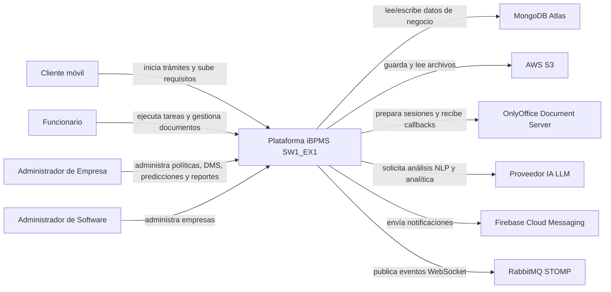
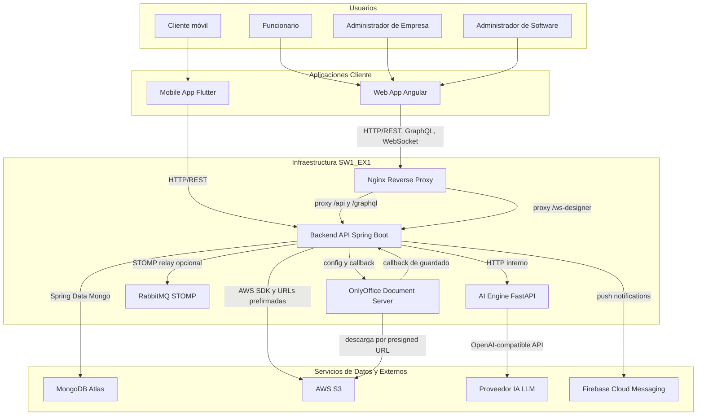
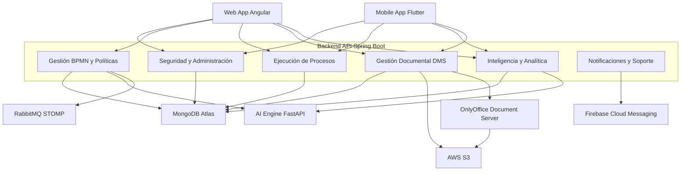
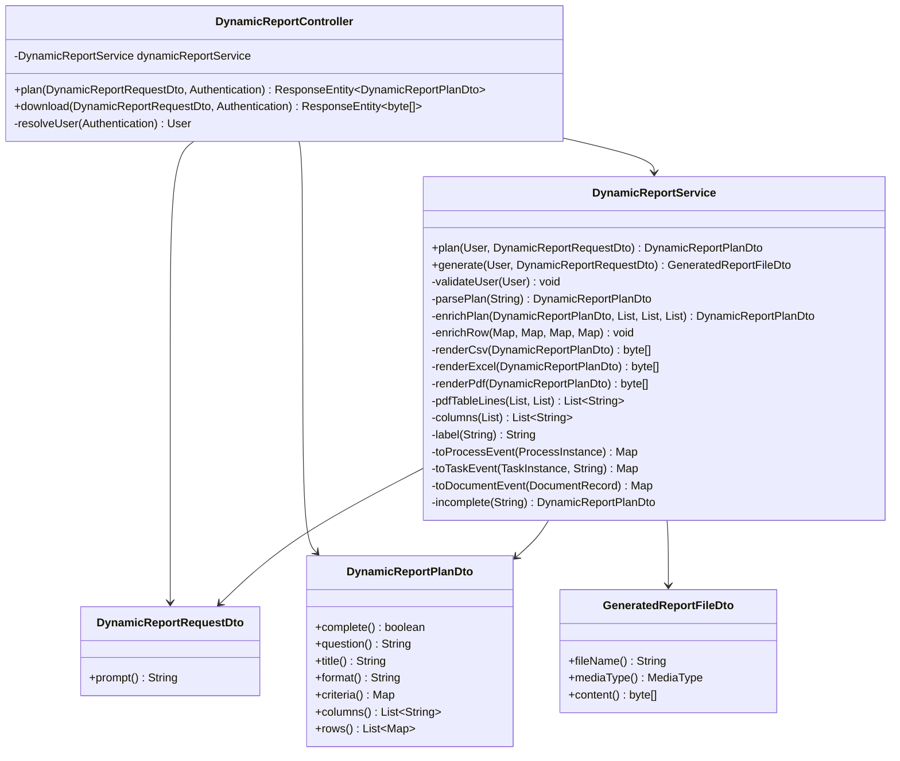
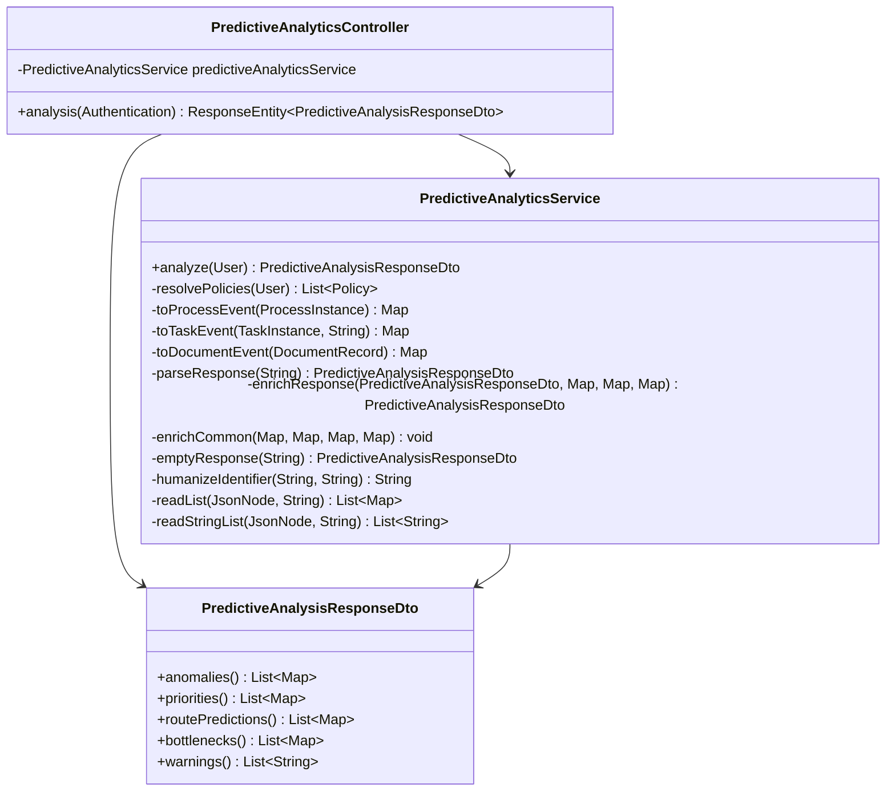
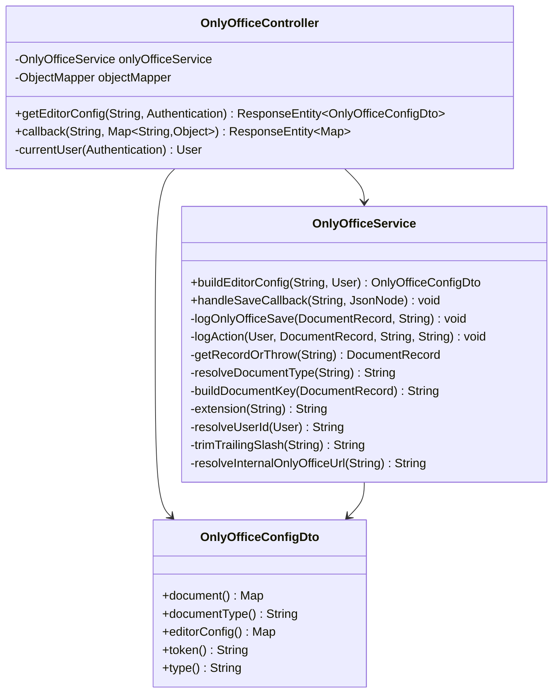

# Modelo C4 - Plataforma iBPMS SW1_EX1

## Alcance

Este documento describe el modelo C4 completo del proyecto `SW1_EX1`, una plataforma iBPMS compuesta por:

- Aplicación web Angular para administración, modelado BPMN, ejecución operativa, DMS, predicciones y reportes.
- Aplicación móvil Flutter para clientes.
- Gateway y motor de workflow en Spring Boot.
- Motor IA en FastAPI para copilot, recomendación de trámites, predicción y reportes dinámicos.
- Servicios externos de almacenamiento, edición documental, mensajería y modelos IA.

El modelo se divide en los 4 niveles C4:

- C1: Contexto del Sistema.
- C2: Contenedores.
- C3: Componentes.
- C4: Código.

---

# C1 - Diagrama de Contexto del Sistema

## Sistema Principal

**Plataforma iBPMS SW1_EX1**

Sistema que permite diseñar políticas BPMN, iniciar trámites, ejecutar tareas, gestionar documentos, editar archivos de forma colaborativa, recomendar trámites con IA, generar predicciones y producir reportes dinámicos.

## Personas

| Persona | Descripción | Uso principal del sistema |
|---|---|---|
| Cliente móvil | Usuario final que inicia trámites desde la aplicación móvil. | Consulta trámites iniciables, completa requisitos iniciales, inicia procesos y revisa tareas asignadas al cliente. |
| Funcionario | Usuario interno que atiende tareas operativas. | Visualiza bandejas de tareas, completa actividades, consulta documentos y edita documentos si tiene permisos. |
| Administrador de Empresa | Responsable de configurar la empresa. | Administra funcionarios, áreas, políticas, privilegios documentales, auditoría, predicciones y reportes. |
| Administrador de Software | Responsable global de la plataforma. | Administra empresas y administradores de empresa. |

## Sistemas Externos

| Sistema externo | Responsabilidad |
|---|---|
| MongoDB Atlas | Persistencia principal de usuarios, empresas, políticas, procesos, tareas, documentos, permisos, auditoría y conversaciones. |
| AWS S3 | Almacenamiento físico de documentos del DMS. |
| OnlyOffice Document Server | Edición colaborativa en tiempo real de documentos Word, Excel y formatos compatibles. |
| Proveedor IA LLM | Procesamiento de lenguaje natural, recomendaciones, predicciones y reportes. |
| Firebase Cloud Messaging | Envío de notificaciones push a la aplicación móvil. |
| RabbitMQ STOMP | Relay para comunicación WebSocket del diseñador colaborativo BPMN. |

## Relaciones

## Lectura Arquitectónica

El sistema centraliza reglas de negocio y seguridad en Spring Boot. Angular y Flutter son clientes de presentación. FastAPI no accede directamente a la base de datos: recibe contexto filtrado por Spring Boot para respetar la separación por empresa y evitar fuga de información.

---

# C2 - Diagrama de Contenedores

## Contenedores Principales

| Contenedor | Tecnología | Responsabilidad |
|---|---|---|
| Web App | Angular | Interfaz para administradores y funcionarios: login, administración, diseñador BPMN, ejecución, DMS, predicciones y reportes. |
| Mobile App | Flutter | Interfaz para clientes: login móvil, trámites iniciables, agente IA, requisitos iniciales y tareas del cliente. |
| Backend API | Spring Boot | API principal, seguridad, workflow engine, DMS, integración S3, OnlyOffice, reportes, predicción y gateway hacia IA. |
| AI Engine | FastAPI | Motor IA para copilot BPMN, recomendación de trámites, extracción por voz, predicción y planificación de reportes dinámicos. |
| Base de Datos | MongoDB Atlas | Persistencia documental y transaccional del sistema. |
| Object Storage | AWS S3 | Almacenamiento de archivos siguiendo la estructura `clientes/{clientId}/tramites/{processInstanceId}/{documentId}_{fileName}`. |
| Document Server | OnlyOffice | Editor colaborativo embebido por Angular. |
| Reverse Proxy | Nginx | Sirve Angular y enruta `/api`, `/graphql` y `/ws-designer` hacia Spring Boot. |
| Message Broker | RabbitMQ | Relay STOMP opcional para colaboración en el diseñador BPMN. |

## Diagrama

## Decisiones Relevantes

| Decisión | Motivo |
|---|---|
| Spring Boot es el gateway de negocio. | Evita que Angular, Flutter o FastAPI accedan directamente a datos sensibles. |
| FastAPI recibe contexto filtrado. | Las predicciones y reportes solo consideran datos de la empresa autenticada. |
| S3 usa URLs prefirmadas. | Permite lectura segura desde OnlyOffice y descarga controlada sin exponer credenciales AWS. |
| OnlyOffice queda como servicio externo. | La edición colaborativa real se delega a un motor especializado. |
| Nginx centraliza rutas. | Simplifica despliegue Docker y evita mezclar URLs internas con URLs públicas. |

---

# C3 - Diagrama de Componentes

Este nivel muestra los componentes principales que viven dentro del Backend API y cómo se conectan con las aplicaciones cliente, el motor IA y los servicios externos. Se mantiene intencionalmente más simple que el nivel de código para que funcione como diagrama arquitectónico.

## Componentes Principales

| Componente | Incluye | Responsabilidad |
|---|---|---|
| Seguridad y Administración | `AuthController`, `AuthService`, `AdminController`, `AdminService`, `SecurityConfig` | Autenticación, roles, empresas, usuarios, áreas y administración base. |
| Gestión BPMN y Políticas | `PolicyService`, `PolicyRepository`, `PolicyDesignerComponent`, `CopilotService` | Diseño, edición colaborativa y publicación de políticas BPMN con requisitos iniciales. |
| Ejecución de Procesos | `ProcessExecutionService`, `WorkflowEngine`, `ProcessInstanceRepository`, `TaskInstanceRepository` | Inicio de trámites, creación de tareas, avance del workflow y bandejas de trabajo. |
| Gestión Documental DMS | `DocumentService`, `DocumentAdminService`, `DocumentAccessService`, `OnlyOfficeService`, `S3Service` | Documentos, permisos, auditoría, almacenamiento S3 y edición colaborativa. |
| Inteligencia y Analítica | `IntelligentReceptionService`, `PredictiveAnalyticsService`, `DynamicReportService`, FastAPI | Recomendación de trámites, predicciones, anomalías, reportes dinámicos y copilot IA. |
| Notificaciones y Soporte | `FirebaseMessagingService`, `MetricsService`, RabbitMQ, Nginx | Notificaciones, métricas, WebSocket y soporte de infraestructura. |

## Diagrama Simplificado

## Detalle por Componente

| Componente | Entradas principales | Salidas principales |
|---|---|---|
| Seguridad y Administración | Credenciales, datos de empresa, usuarios y roles. | JWT, usuarios administrados, empresas, áreas y restricciones de acceso. |
| Gestión BPMN y Políticas | Diagramas BPMN, requisitos iniciales y solicitudes del copilot. | Políticas publicadas, diagramas guardados y sugerencias IA aplicadas. |
| Ejecución de Procesos | Política seleccionada, formularios y acciones de tarea. | Instancias de proceso, tareas pendientes, tareas completadas y avance del workflow. |
| Gestión Documental DMS | Archivos, permisos, acciones de usuario y callbacks de OnlyOffice. | Documentos en S3, permisos, auditoría y versiones editadas. |
| Inteligencia y Analítica | Texto del cliente, event logs, criterios de reporte y datos por empresa. | Trámites candidatos, predicciones, anomalías, cuellos de botella y reportes. |
| Notificaciones y Soporte | Eventos de tareas, métricas y eventos WebSocket. | Push notifications, métricas y colaboración en tiempo real. |

---

# C4 - Diagrama de Código

## Enfoque del Nivel 4

En C4, el nivel de código no debe representar todo el sistema completo ni repetir servicios externos. Debe hacer zoom dentro de un componente específico y mostrar sus clases, métodos y responsabilidades internas.

- **Reportes dinámicos**, porque mezcla Angular, Spring Boot, FastAPI, validación semántica y generación de archivos.
- **Predicción por empresa**, porque transforma histórico de procesos en event logs y consume análisis IA.
- **Edición documental colaborativa**, porque coordina permisos, S3, OnlyOffice, callbacks y auditoría.

Estos tres diagramas son vistas de código representativas. Las dependencias externas no se modelan aquí como participantes; solo aparecen los elementos internos del componente.

---

## C4A - Código Interno: Componente de Reportes Dinámicos

### Clases

| Clase | Tipo | Responsabilidad |
|---|---|---|
| `DynamicReportController` | Spring Boundary | Expone `plan()` y `download()` para administradores de empresa. |
| `DynamicReportService` | Spring Control | Orquesta validación, construcción de payload, interpretación del plan y generación del archivo. |
| `DynamicReportRequestDto` | DTO | Contiene el texto solicitado por el administrador. |
| `DynamicReportPlanDto` | DTO | Representa el plan analítico: completitud, pregunta, formato, columnas y filas. |
| `GeneratedReportFileDto` | DTO | Encapsula contenido binario, nombre de archivo y media type. |

### Diagrama de Código Interno

### Métodos Clave

| Clase | Métodos |
|---|---|
| `DynamicReportController` | `plan()`, `download()`, `resolveUser()` |
| `DynamicReportService` | `plan()`, `generate()`, `validateUser()`, `parsePlan()`, `enrichPlan()`, `renderPdf()`, `renderExcel()`, `renderCsv()`, `toProcessEvent()`, `toTaskEvent()`, `toDocumentEvent()` |

---

## C4B - Código Interno: Componente de Predicción por Empresa

### Clases

| Clase | Tipo | Responsabilidad |
|---|---|---|
| `PredictiveAnalyticsController` | Spring Boundary | Expone el análisis predictivo para `COMPANY_ADMIN`. |
| `PredictiveAnalyticsService` | Spring Control | Filtra datos por empresa, arma event logs y normaliza la respuesta predictiva. |
| `PredictiveAnalysisResponseDto` | DTO | Transporta anomalías, prioridades, rutas, cuellos de botella y advertencias. |

### Diagrama de Código Interno

### Métodos Clave

| Clase | Métodos |
|---|---|
| `PredictiveAnalyticsController` | `analysis()` |
| `PredictiveAnalyticsService` Spring | `analyze()`, `resolvePolicies()`, `toProcessEvent()`, `toTaskEvent()`, `toDocumentEvent()`, `parseResponse()`, `enrichResponse()` |

---

## C4C - Código Interno: Componente de Edición Documental Colaborativa

### Clases

| Clase | Tipo | Responsabilidad |
|---|---|---|
| `OnlyOfficeController` | Spring Boundary | Expone configuración del editor y callback de guardado. |
| `OnlyOfficeService` | Spring Control | Construye configuración del editor, valida formato, procesa callbacks y registra guardados. |
| `OnlyOfficeConfigDto` | DTO | Estructura de configuración enviada al editor colaborativo. |

### Diagrama de Código Interno

### Métodos Clave

| Clase | Métodos |
|---|---|
| `DocumentViewerComponent` | `loadDocument()`, `openOnlyOfficeEditor()`, `ensureOnlyOfficeScript()` |
| `ExecutionService` | `getDocument()`, `getOnlyOfficeConfig()` |
| `OnlyOfficeController` | `getEditorConfig()`, `callback()`, `currentUser()` |
| `OnlyOfficeService` | `buildEditorConfig()`, `handleSaveCallback()`, `logOnlyOfficeSave()`, `getRecordOrThrow()`, `resolveDocumentType()`, `buildDocumentKey()`, `extension()` |
| `S3Service` | `uploadFile()`, `createPresignedReadUrl()`, `replaceObject()` |

---

## Resumen de Paquetes Arquitectónicos

| Paquete funcional | C4 donde aparece con más fuerza | Módulos principales |
|---|---|---|
| Gestión de Acceso y Administración | C1, C2, C3 | Angular admin, `AdminController`, `AdminService`, `AuthService`, MongoDB. |
| Diseño Colaborativo de Políticas BPMN | C2, C3 | `PolicyDesignerComponent`, `PolicyService`, `WebSocketConfig`, RabbitMQ, Copilot IA. |
| Ejecución Operativa de Procesos | C2, C3 | Flutter dashboard, bandejas Angular, `ProcessExecutionService`, `WorkflowEngine`. |
| Servicios de Soporte | C2, C3 | S3, Firebase, RabbitMQ, Nginx, métricas. |
| Integración Inteligente Copilot IA | C1, C2, C3, C4 | FastAPI, LLM, recepción inteligente, predicción y reportes. |
| Gestión Documental DMS | C1, C2, C3, C4 | `DocumentService`, `DocumentAccessService`, `OnlyOfficeService`, S3, auditoría. |

---

## Recomendación para Presentación

Para entregar el C4 en una herramienta como Visual Paradigm:

- El C1 debe mostrar actores y sistemas externos, sin clases ni endpoints.
- El C2 debe mostrar aplicaciones, servicios desplegables, bases de datos y servicios externos.
- El C3 debe hacer zoom principalmente al Backend API y al AI Engine.
- El C4 debe enfocarse en componentes críticos, no en todo el sistema a la vez.
